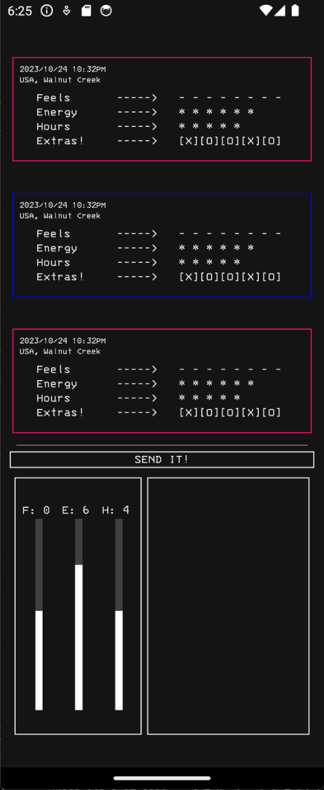

# Stat-Logger

Stat-Logger is an open source, React Native app that can be used to track a person's mood, along with a vareity of statistics that could have influenced that mood.

## Screenshots

Screen shots of the application:

## How to use

- Use the sliders and check boxes at the bottom of the screen to fill our your information
- Press the submit button in order to send the stat to the list of the top of the list
- Scroll through the feed at the top of the list to see your stats at the current date

## Things I would like to add

- The ability to change the parameters through the app
- The ability to delete Individual "Stat Logs"

## DIY Compilation

- In order to compile this app, you will need to make use of the
- Expo react native client
- The react native elements Library
- Android Studio
-

## Credit

This app makes use of the React Native Elements Library, and I made use of several react native tutorials by
